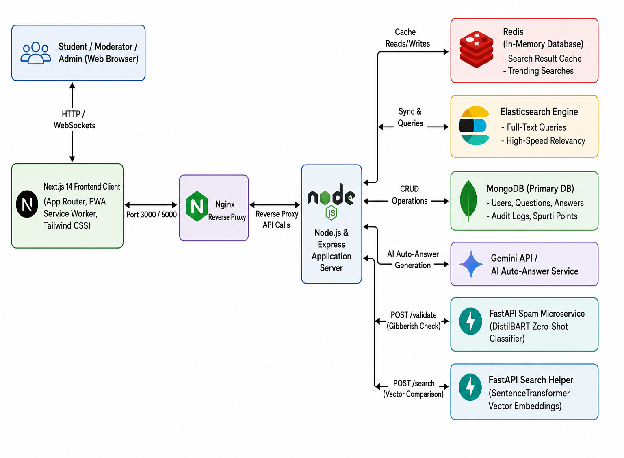
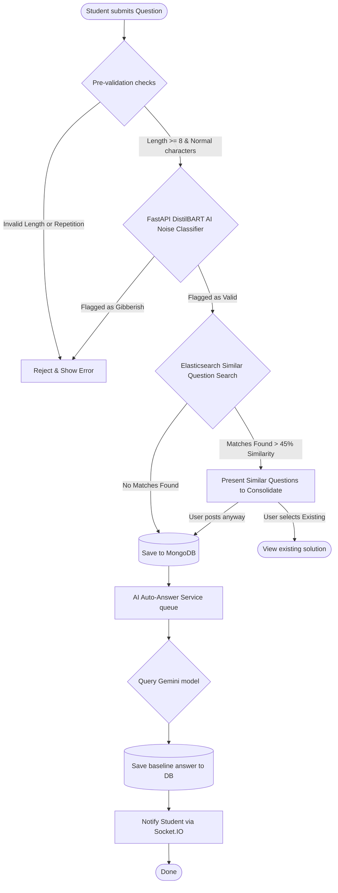
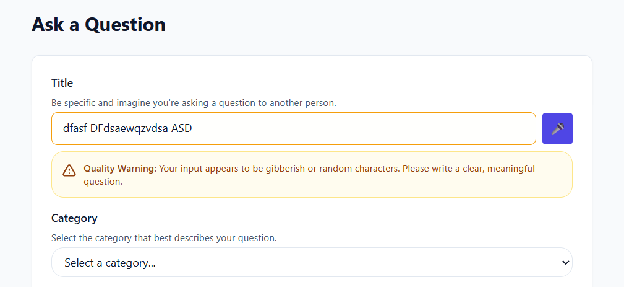
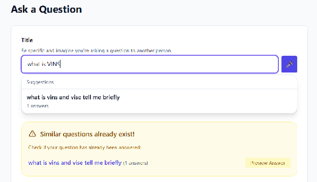
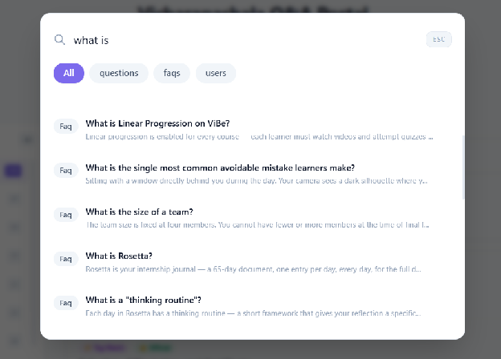
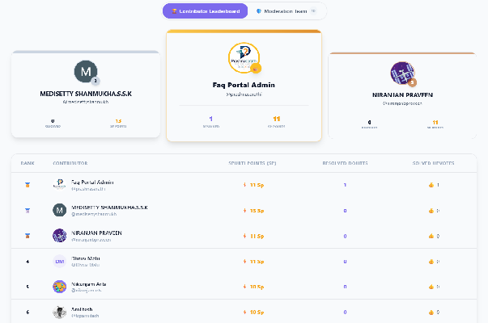

# Crowd Sourcing FAQ Project Report: PrashnaSārathi (प्रश्नसारथि)

  

---

## 1. Title Page

* **Project Name:** PrashnaSārathi (प्रश्नसारथि) — Community Q&A and FAQ Platform
* **Deployment/Demo URL:** [https://prashnasarathi.vercel.app/](https://prashnasarathi.vercel.app/)
* **Repository Link:** [https://github.com/vicharanashala/team-6a2f9eda838e10dacabedd15](https://github.com/vicharanashala/team-6a2f9eda838e10dacabedd15)
* **Team Members:**

| Name | Email |
| :--- | :--- |
| **Niranjan Praveen** | [niranjanbpraveen@gmail.com](mailto:niranjanbpraveen@gmail.com) (Team Lead) |
| **Medisetty Shanmukh** | [medisettyshanmukh@gmail.com](mailto:medisettyshanmukh@gmail.com) |
| **Divyanshi Mishra** | [divyanshimishra480@gmail.com](mailto:divyanshimishra480@gmail.com) |
| **Dhruv Malu** | [dhruvmalu6@gmail.com](mailto:dhruvmalu6@gmail.com) |
| **Mudimadugula Srija** | [msrija2002@gmail.com](mailto:msrija2002@gmail.com) |
| **Rohit Wadettiwar** | [rohitwadettiwar.ds24@sbjit.edu.in](mailto:rohitwadettiwar.ds24@sbjit.edu.in) |
| **Shawshank Redemp** | [shawshank.redemp5@gmail.com](mailto:shawshank.redemp5@gmail.com) |
| **Tsp Amiitesh** | [tspamiitesh@gmail.com](mailto:tspamiitesh@gmail.com) |
| **Kinnera Swetha** | [Kinneraswetha04@gmail.com](mailto:Kinneraswetha04@gmail.com) |
| **Priteenanda Das** | [cse.23bcsh44@silicon.ac.in](mailto:cse.23bcsh44@silicon.ac.in) |
---

## 2. Executive Summary

### 2.1 The Challenge

In educational institutions and community learning hubs, students frequently encounter obstacles when trying to resolve their doubts. Two primary problems exist:

## 1. **Fear of Asking:** Many students suffer from social anxiety or fear of peer judgment, preventing them from raising their hand in class or posting on public forums.  
## 2. **Repetitive Workload:** Teachers and administrators are often overwhelmed by the same questions being asked repeatedly, leading to delayed responses and scattered information.

### 2.2 The Solution: PrashnaSārathi

**PrashnaSārathi** is an intelligent, community-driven Q&A and FAQ platform designed to make learning collaborative, engaging, and efficient. The platform organizes its functionalities into five key areas:

* **Core Q&A Module:** Supports anonymous posting to remove the fear of asking, similar question warnings to prevent duplicates, automated content quality checks, confidence indicators on replies, and an AI Auto-Answer service that generates baseline replies instantly.  
* **FAQ System Module:** Organizes official institutional knowledge into category-based accordion views, monitors FAQ helpfulness via a feedback tracker, and tags verified answers with official badges.  
* **Gamification Module:** Encourages student participation through daily streaks with hardcore penalty resets, a reputation/Spurti Points (SP) reward economy, and a dynamic leaderboard ranking top contributors.  
* **Search & Discovery Module:** Features a fast Ctrl+K instant search modal, powered by a hybrid Elasticsearch/Mongoose engine, and Redis caching for trending search queries.  
* **Admin & Moderation Module:** Equips moderators with dashboard statistics, role/user management with audit logs, and a cache manager to push updates instantly.

### 2.3 Key Outcomes & Impact

By deploying PrashnaSārathi, communities can achieve:

* **Deliberate Quality Control:** Zero-shot AI filtering blocks spam while similarity searches guide students to existing answers before they submit a duplicate.  
* **Friendly Peer Competition:** Streaks and points incentivize users to write high-quality answers and climb the leaderboard rankings.  
* **Rapid Doubt Resolution:** Real-time AI auto-answers and cached search queries ensure students get accurate guidance in seconds, saving valuable instructor time.

## 3. Introduction

### 3.1 Background & Context

In modern educational institutions and learning communities, doubt resolution is one of the most critical parts of academic success. However, traditional communication methods are often fragmented. Important academic information, course FAQs, and students' doubts end up scattered across emails, chat groups, and local message boards. This fragmentation leads to:

* **Information Loss:** Highly valuable answers provided by professors or senior peers are lost in chat histories, meaning the same questions must be answered repeatedly.  
* **Student Hesitation:** Many students feel intimidated to ask questions in large groups or public forums due to the fear of peer judgment or social anxiety.  
* **Instructor Burnout:** Faculty members and course moderators spend excessive hours answering duplicate questions instead of focusing on complex doubts.

**PrashnaSārathi** (Sanskrit for "The Question Guide" or "Doubt Charioteer") was created to solve these challenges. It establishes a centralized, structured, and intelligent "single source of truth" for academic doubts and official institutional information.

### 3.2 The Core Pillars of PrashnaSārathi

To bridge the gap between students, educators, and knowledge, the platform is designed around four key operational pillars:

#### **1. Safe & Inclusive Q&A (Removing the Fear of Asking)**

Social anxiety is a real barrier to learning. PrashnaSārathi offers an **Anonymous Posting** toggle for both questions and answers. Students can ask simple, foundational, or sensitive questions without revealing their identity to their peers. This creates a safe learning environment where the only priority is finding the solution.

#### **2. Instant Search & Automated Answering (Accelerating Resolution)**

Students expect fast answers. The platform uses a hybrid architecture to ensure doubts are resolved in seconds:

* **Pre-Submission Similarity Check:** As a user types, the system instantly cross-references their text with existing questions to warn them of duplicates.  
* **Instant Ctrl+K Search:** A global autocomplete panel allows users to search across FAQs, questions, and users instantly.  
* **AI Auto-Answers:** For newly posted questions, the platform triggers a background AI service to generate a context-grounded baseline reply immediately, providing students with instant guidance.  
  

#### **3. Healthy Engagement Mechanics (Gamifying Academic Help)**

Traditional forums feel dry and transactional. PrashnaSārathi introduces game mechanics to encourage active peer-to-peer assistance:

* **The Mascot Companion (Pyro):** An evolvable creature representing the user's progress.  
* **Streaks & Progression:** A daily login streak tracker keeps students returning. EXP is awarded for daily activity, but a **Hardcore Penalty** resets progress if a day is missed.  
* **Reward Economy:** Users earn **Spurti Points (SP)** for writing helpful answers, which they can spend in the shop to purchase accessories for Pyro.  
* **Leaderboards:** Ranks top community contributors, highlighting active peer helpers.  
  

#### **4. Automated Quality Assurance (Protecting Community Value)**

To prevent the platform from turning into a chaotic chatroom, PrashnaSārathi features automated quality controls:

* **FastAPI Spam Microservice:** An AI-powered classification pipeline checks new questions for spam, single-character keyboards smashes, and off-topic noise before they get published.  
* **Moderation Suite:** Administrators and moderators can flag inappropriate content, modify user roles, ban toxic accounts, and clear cache storage to keep information clean and safe.

## 4. System Design / Architecture + Diagrams

The application utilizes a multi-tier architecture composed of a Next.js frontend, an Express API gateway, separate Python FastAPI microservices, and databases (MongoDB, Redis, and Elasticsearch) orchestrated in a containerized Docker ecosystem.

### 4.1 System Architecture Diagram 

The diagram below details the data flow between client devices, search layers, auxiliary cache services, and the core processing engines.

### 4.2 Question Creation and AI Guardrail Flowchart 

This flowchart highlights the automated quality-filtering and duplicate-checking system applied when a user submits a question.

## 5. Implementation

### 5.1 Tech Stack & Justifications 

| Technology | Why It Was Chosen |
| :---- | :---- |
| **Next.js 14 (App Router)** | Gives server-side rendering out of the box, improving page load speed and making the knowledge base indexable by search engines. A plain React SPA would have missed both benefits. |
| **MongoDB (Mongoose)** | Questions, answers, FAQs, audit logs, and point ledgers all have different data shapes. MongoDB handles this without forcing a rigid table structure that SQL would require. |
| **Elasticsearch** | MongoDB's native text search is not strong enough for this use case. Elasticsearch provides fuzzy matching, relevance scoring, and full-text indexing at a speed MongoDB cannot match. |
| **Redis** | Search is the most-used feature. Caching results for 60 seconds reduces load dramatically without users noticing any difference in freshness. |
| **FastAPI (Python)** | The AI models (DistilBART, SentenceTransformer) run in Python. FastAPI provides a lightweight, production-ready HTTP server that integrates natively with HuggingFace and PyTorch. Node.js cannot run these models efficiently. |
| **Socket.IO** | Polling the server every few seconds is wasteful and slow. Socket.IO keeps a persistent open connection so all live updates — votes, notifications, mascot EXP — are instant. |
| **Tailwind CSS** | Utility-first styling makes dark/light theme switching simple and keeps the CSS bundle small without losing design control. |
| **Docker + Nginx** | Containerising all six services means the entire platform runs identically on any machine. Nginx routes traffic cleanly between them. |

### 5.2 Module & Feature Breakdown  

**Q&A Core Module**  
Students create questions using a TipTap rich text editor that supports formatting, image upload, and hyperlinks. They can choose to post anonymously if they are uncomfortable using their name. When answering, students pick a confidence level — 'I think so', 'Pretty sure', or 'I know this' — which helps other readers judge how reliable the answer is.

Any answer can be upvoted or downvoted with an optional reason. There are two separate engagement signals beyond voting:

* Me Too button — clicked when a student has the same doubt. This bumps the question's priority in the algorithm so it gets resolved faster.  
* Solved My Doubt button — separate from upvoting. It records whether an answer actually resolved someone's problem. This is a more honest signal than a like and is used in leaderboard and quality calculations.

Moderators and admins can mark the best answer as accepted, which triggers a confetti animation as positive feedback for the contributor.

**AI Quality Pipeline**  
Every question goes through three checks before it is saved:

* Noise filter — FastAPI sends the question to DistilBART, which classifies it as genuine or noise. If it is noise, it is rejected immediately with a message to the student. No human moderation needed.  
    
    
* Duplicate check — Elasticsearch checks the new question for semantic similarity against existing ones. If a match above 45% similarity is found, the student is shown those questions and asked if one already answers their doubt. If they choose to post anyway, it goes through.  
    
    
* AI auto-answer — once saved, the question is sent to Gemini API which generates a contextual baseline answer and posts it as an AI reply. The student gets something useful immediately.

**FAQ System**  
The platform contains 126 pre-seeded FAQs organised into categories. Each FAQ can be marked as 'Official' or 'Master FAQ' by admins — this signals it is the canonical answer on that topic. Students rate each FAQ as helpful or not helpful, giving admins data on which FAQs are outdated. FAQs can be saved to a personal list with personal notes attached.

**Search and Discovery**  
  
The search modal opens from anywhere using Ctrl+K or the '/' key. Results come from Elasticsearch and cover questions, FAQs, and users. They can be sorted by relevance, date, or popularity. Students can also browse by topic tags. Voice search is available — clicking the microphone or saying 'Hey PrashnaSarathi' opens the modal and starts recording the query directly.  
**Gamification Module**  
Pyro is a draggable floating mascot that remains visible to all logged-in students and preserves its position across sessions. Students earn +15 EXP through daily logins, allowing Pyro to evolve through three stages—Junior (Levels 0–2), Evolved (Level 3), and Ultimate (Level 4+). To encourage consistent engagement, a Hardcore Reset Penalty resets a user's level, EXP, and login streak to zero if a single day is missed. 

Students also earn Spurti Points (SP) by contributing to the community through asking questions, answering doubts, and receiving votes. These points can be spent in the SP Shop to purchase cosmetic accessories for Pyro, such as Shark Hats and Balloons. 

Additionally, a Dynamic Contribution Leaderboard ranks users based on their reputation and Spurti Points, fostering healthy competition, recognizing top contributors, and motivating students to actively participate in peer-to-peer learning.  
  
**User and Role System**  
Authentication is JWT-based with email verification. Each user has a profile with a custom avatar, bio, reputation score, achievement badges, and activity stats. Three roles exist: User (standard access), Moderator (content management), and Admin (full platform control).

**Admin and Moderation Suite**  
The admin dashboard shows live stats — daily active users, total questions, total answers. Admins can manage every user account, change roles, and ban or unban with a tracked reason. There is a flagged content queue for reported questions and answers. The Spurti Points tracker logs every point transaction. Admins can flush the Redis cache with one click. A bulk broadcast email goes to all active users. Every admin action is logged in a full audit trail for accountability.

## 6. Feature Spotlight

**Note- To see the Video Demo of The Features You can click on feature you like and it will redirect to the demo** 

### 6.1 Core Q&A Module

- [**Anonymous Posting:**](https://drive.google.com/file/d/1jIU_cYzeRPdcyRdkIdnHfgfw5oO1kc-L/view?usp=drive_link) Option to post questions anonymously.  
  Purpose: Protect student privacy and encourage questioning.  
  Real-world Usefulness: Helps shy students ask simple or sensitive doubts without fear of judgment from peers.  
    
- [**Similar Question Warning:**](https://drive.google.com/file/d/1fYCWvH4Pw-Mv-Zi8-IEboy0Q0guLq1BK/view?usp=drive_link) Shows similar existing questions in real-time as the user types.

            Purpose: Prevent duplicate questions.  
            Real-world Usefulness: Reduces website clutter and guides students straight to existing solutions  
.

- [**Content Quality Checker:**](https://drive.google.com/file/d/16oZ_hbXT1P8_UVN4uPFQhTQh0QEPTlPY/view?usp=drive_link) An AI service that scans new questions to filter out gibberish or spam.  
  Purpose: Keep the community platform clean.  
  Real-world Usefulness: Instantly rejects random strings (like "aaaaa" or keyboard-smash text) before they get posted  
    
- [**Confidence Indicators on Answers:**](https://drive.google.com/file/d/1u1aI2o84s4M60HRGC7XfeT1LR7ZsE-TS/view?usp=drive_link) When submitting an answer, users pick their level of confidence: 🤔 I think so, 👍 Pretty sure, or 💯 I know this.  
  Purpose: Inform readers of answer certainty.  
  Real-world Usefulness: Helps students evaluate the reliability of peer answers.  
    
- [**"Me Too" and "Solved My Doubt" Indicators:**](https://drive.google.com/file/d/1Wp7rBlxSLX0m38YH_U2alOYYasxXEKfP/view?usp=drive_link)  
  Purpose: Track user interest and genuine problem resolution.  
  Real-world Usefulness: "Me Too" boosts the priority of unanswered doubts. "Solved My Doubt" tracks how many students were actually helped, providing a better success metric than generic upvote

.

- [**AI Auto-Answer Service:**](https://drive.google.com/file/d/1LUXVljYw_YrQNm4mliM8XuuhC6NkQcXa/view?usp=drive_link) Backend service that automatically generates context-grounded baseline replies for student questions.  
  Purpose: Decrease reply wait times.  
  Real-world Usefulness: Students get a helpful AI-driven response within seconds, resolving common doubts instantly.  
  

### 6.2 FAQ System Module

- [**Category Browsing**:](https://drive.google.com/file/d/1v1QaQgdR19KRhj2EL4wGoWBjxdQs86os/view?usp=drive_link) FAQs are organized by subject categories in clean accordion views.  
  Purpose: Make official institutional information easily browsable.  
  Real-world Usefulness: Quick navigation for standard issues like NOC applications, exam rules, or fee guidelines.

- [**FAQ Feedback Tracker:**](https://drive.google.com/file/d/1XhBgyza-FNLQeQb7TbjenLNLBoiLEKA8/view?usp=drive_link) A simple "Yes / No" helpfulness feedback button on each FAQ page.  
  Purpose: Monitor the quality of official FAQs.  
  Real-world Usefulness: Flags outdated or confusing FAQs so administrators know what to update.

- [**Official Badges:**](https://drive.google.com/file/d/1gDKdVUzwQ-zicrNi2dpOTLnT-ehgM9Et/view?usp=drive_link) Verified answers and FAQ pages stand out with unique tags.  
  Purpose: Establish trust markers for verified content.  
  Real-world Usefulness: Students instantly recognize answers published by professors or administrators.

### 6.3 Gamification Module

- [**Daily Login Streaks & Progression:**](https://drive.google.com/file/d/1iKXN70IdrrMRnAOGnkId1nmYJIskkBAf/view?usp=drive_link) A streak tracker that awards +15 EXP points for daily logins. Pyro evolves into different stages (Junior → Evolved → Ultimate)depending on user level thresholds.  
  Purpose: Retain daily active users.  
  Real-world Usefulness: Hardcore Reset Penalty resets user level and EXP to 0 if they miss a single day, introducing game mechanics to keep students logging in.

- [**Spurti Points (SP):**](https://drive.google.com/file/d/1Vf-gt0omuyLR0JVOV_8E08r7dC0KbMdF/view?usp=drive_link) A reward economy where students earn points for answering doubts and spend them on accessories for Pyro (e.g., Shark Hat, Balloons).  
  Purpose: Incentivize community contribution.  
  Real-world Usefulness: Encourages students to write high-quality answers to earn virtual rewards.

- [**Dynamic Contribution Leaderboard:**](https://drive.google.com/file/d/1Yi1Ya_3Gus4N0tJIoRylJooxEYyDCC2j/view?usp=drive_link) A live board ranking top users in the community.  
  Purpose: Foster friendly competition and highlight top helpers.  
  Real-world Usefulness: Ranks students based on their accumulated reputation and Spurti Points, allowing administrators to reward the most helpful peers.

### 6.4 Search and Discovery Module

- [**Instant Search Modal (Ctrl+K):**](https://drive.google.com/file/d/10ps_UALGl44SOfiYmZZ4ajIVTJyK4HOb/view?usp=drive_link) A global search overlay accessible from anywhere on the platform by pressing Ctrl+K or /.  
  Purpose: Provide fast access to knowledge.  
  Real-world Usefulness: Search across questions, FAQs, and users instantly without reloading pages.  
    
- [**Hybrid Search Engine:**](https://drive.google.com/file/d/1zLKfpvuDFU6NsLSx6lQVSuTL921n17Gy/view?usp=drive_link) Powered by Elasticsearch with a fallback to database queries.  
  Purpose: Perform fast, fuzzy search matching.  
  Real-world Usefulness: Handles typos and retrieves relevant results immediately.  
    
    
- [**Redis Caching:**](https://drive.google.com/file/d/1zLKfpvuDFU6NsLSx6lQVSuTL921n17Gy/view?usp=drive_link) Caches search results and tracks trending keywords.  
  Purpose: Speed up common searches and reduce database load.  
  Real-world Usefulness: Instant loading of popular queries during peak exam preparation times.

### 6.5 Admin & Moderation Module

- [**Admin Dashboard Stats:**](https://drive.google.com/file/d/1M8yaW8ba0OLV8gbB-NqUxQMabg5vEuWA/view?usp=drive_link) Live charts showing daily active users (DAU), question volumes, and pending moderation queues.  
  Purpose: Keep track of community health.  
  Real-world Usefulness: Provides administrative overview at a glance.  
    
- [**User Management & Audit Logs:**](https://drive.google.com/file/d/1E5gjGNvRceLGMEx5HWlxiW9gyU8BoTZa/view?usp=drive_link) Tools to edit user roles, search users, and ban/unban with reason tracking.  
  Purpose: Maintain a safe platform.  
  Real-world Usefulness: Allows moderators to take action on toxic users and log all moderation steps for accountability.  
    
- [**One-Click Cache Manager**:](https://drive.google.com/file/d/1rp-GUycph3V9CV0MLi4Yy-p-eqWeDLfO/view?usp=drive_link) Button for administrators to clear Redis caches instantly.  
  Purpose: Refresh static information.  
  Real-world Usefulness: Forces immediate updates when official FAQ changes occur.

## 7. Challenges & Limitations

* **AI Model Processing Latency (Speed vs. Server Costs):**  
    
  Running Hugging Face machine learning models (like DistilBART for zero-shot spam filtering and SentenceTransformers for vector comparison) requires significant CPU and memory resources. On standard, budget-friendly hosting platforms without dedicated GPU hardware, these Python FastAPI microservices experience "cold-start" delays. When a user submits a question after a period of inactivity, it can take 2 to 3 seconds for the model to load and respond, which temporarily slows down the real-time submission flow.  
    
* **Real-time Database and Search Index Sync (MongoDB & Elasticsearch):**  
    
  To enable high-speed fuzzy search, the system replicates question and FAQ data from the primary MongoDB database to the Elasticsearch index. The key challenge is keeping these two databases perfectly synchronized. When questions are added, updated, or deleted, the changes must immediately reflect in the Elasticsearch search index. If a network delay or minor server glitch occurs during replication, the search results can become temporarily outdated, showing stale or deleted questions.  
    
* **Serverless Hosting Constraints (Vercel Deployment & Fallbacks):**   
    
  While Vercel is used to host the application frontend, its serverless environment does not support persistent running processes. This creates significant challenges for:  
    
- **Socket.IO WebSockets:** 

  Vercel serverless functions run on-demand and terminate quickly, which disconnects traditional WebSocket servers. To bypass this, the frontend includes a **Fallback Polling Engine** that automatically switches to periodic HTTP polling (every 8 seconds) if a Socket.IO connection cannot be maintained, and uses Web Push messages to display notifications.

- **External Service Dependencies:** 

  Persistent services like Elasticsearch, Redis caching, and the FastAPI Python AI models cannot run directly inside Vercel's runtime. They must be hosted externally on persistent cloud servers (like Render or Railway) and connected via secure API gateways.

## 8. Future Enhancements

* **Doubt Resolution Dashboard (/my-doubts):**

   A centralized, personalized workspace for students to track all of their active and historical doubts. Instead of searching through multiple pages, students can view a unified checklist showing whether their questions are currently being processed by the AI service, have been escalated to a human moderator, have received new replies, or are marked as solved. It will also display individual learning stats, such as total doubts resolved and help points accumulated.

* **"Similar Solved Doubts" Sidebar Recommendations:**

   An intelligent side panel that automatically suggests related, already-answered questions while a student is reading a post. By comparing the context of the active question with the historical database, the system can instantly guide students to verified solutions to similar problems, allowing them to learn continuously without having to trigger new searches.

* **Weekly Academic Doubt Digest (Automated Summaries):** 

  A scheduled weekly email report customized for both students and instructors. For students, it will highlight the most viewed questions, top solved doubts, and trending academic topics of the week. For teachers, it will provide a brief summary of the most common issues students faced (e.g., recurring doubts about a specific assignment), helping them identify topics that need more explanation in class.

* **Threaded Follow-Up Discussions (Nested Replies):** 

  A clean, nested messaging thread directly under individual answers. This will allow students to ask quick clarifying questions (e.g., asking for an explanation of a specific line of code or step in a formula) directly under a response without cluttering the main page or posting duplicate general answers.

## 9. Conclusion

**PrashnaSārathi** successfully modernizes and simplifies how academic doubts are resolved and shared within schools, universities, and online learning communities. By creating a centralized "source of truth," the platform bridges the gap between students who need help and the educators or peers who can provide it.

### 9.1 Summary of Project Achievements

Throughout the development of this project, we successfully addressed the core issues of student anxiety and administrative fatigue through several key features:

* **Promoting Academic Inclusivity:** The introduction of anonymous posting options and a friendly mascot companion (Pyro) creates a supportive, low-pressure environment. This encourages shy or anxious students to ask questions freely, increasing total platform participation.  
* **Saving Time & Restoring Focus:** By leveraging AI-powered spam detection and real-time duplicate checks, the system filters out low-quality posts and consolidates matching questions. This helps moderators and teachers focus their energy on complex doubts rather than answering the same questions repeatedly.  
* **Robust, Real-time Infrastructure:** Integrating high-speed search layers (Elasticsearch), instant cache retrieval (Redis), and real-time event broadcasting (Socket.IO) ensures that the user interface feels incredibly responsive, fast, and interactive, even under high-traffic conditions.

### 9.2 Final Verdict

PrashnaSārathi is a scalable, secure, and ready-to-deploy platform that turns academic collaboration into an engaging game. By removing barriers to asking questions and automating content quality assurance, it fosters a healthy, self-sustaining learning ecosystem. The resulting system is prepared for real-world deployment in modern academic institutions to improve the educational experience for both students and instructors.
