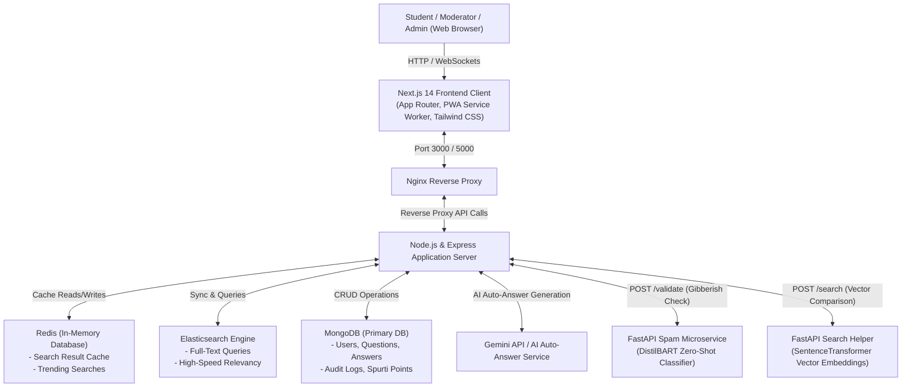

# Crowd Sourcing FAQ Project Report: PrashnaSārathi (प्रश्नसारथि)

  

---

## 1. Title Page

* **Project Name:** PrashnaSārathi (प्रश्नसारथि) — Community Q&A and FAQ Platform
* **Deployment/Demo URL:** [https://prashnasarathi.vercel.app/](https://prashnasarathi.vercel.app/)
---

## 2. Executive Summary

In academic institutions and communities, students often struggle to ask questions due to social anxiety, peer judgment, or complex interface layouts. Moreover, similar doubts are asked repeatedly, which exhausts resources and creates a disjointed knowledge base. 

**PrashnaSārathi** addresses these problems by providing an anonymous, gamified, and AI-assisted platform. By using machine learning models for duplicate detection and automatic baseline answering, alongside real-time web technologies and an interactive mascot companion, the platform lowers barrier-to-entry for questioning while providing quick resolutions and high user engagement.

---

## 3. Introduction

PrashnaSārathi is a next-generation community-driven FAQ and Q&A ecosystem. Its primary goals are to:
1. **Remove Fear:** Offer anonymous question options and an approachable user experience.
2. **Accelerate Doubt Resolution:** Instantly query existing FAQs, detect duplicate submissions, and generate AI-driven baseline answers immediately upon posting.
3. **Engage Users:** Utilize gamified streaks, evolvable companion mascots, and a Spurti Points rewards economy.
4. **Maintain Quality:** Prevent spam, noise, and gibberish submissions using zero-shot classification pipelines.

---

## 4. System Design / Architecture + Diagrams

The application utilizes a multi-tier architecture composed of a Next.js frontend, an Express API gateway, separate Python FastAPI microservices, and databases (MongoDB, Redis, and Elasticsearch) orchestrated in a containerized Docker ecosystem.

### 4.1 System Architecture Diagram

The diagram below details the data flow between client devices, search layers, auxiliary cache services, and the core processing engines.

### 4.2 Question Creation and AI Guardrail Flowchart

This flowchart highlights the automated quality-filtering and duplicate-checking system applied when a user submits a question.

---

## 5. Implementation

### 5.1 Tech Stack & Justifications

* **React 18 & Next.js 14 (App Router):** Chosen for fast client-side rendering (CSR), search-engine optimization (SEO), and dynamic route rendering.
* **Node.js & Express 4:** Selected for non-blocking asynchronous I/O, event-driven request handling, and easy web socket integration.
* **MongoDB (Mongoose):** Flexible schema models match polymorphic records like audit logs, point ledger books, user credentials, and dynamic questions.
* **Elasticsearch:** Dedicated text-indexing engine enabling rapid fuzzy matching and high-speed full-text queries that would otherwise overwhelm Mongoose database tables.
* **Redis:** Acts as a caching tier to store search results for 60 seconds and track trending search queries in real time.
* **FastAPI (Python 3):** Powers lightweight machine learning endpoints due to native integration with HuggingFace (`transformers`) and PyTorch.

---

### 5.2 Module & Feature Breakdown

1. **Core Q&A Module:** Supports rich-text descriptions (TipTap), tags, voting, custom confidence levels ("🤔 I think so", "👍 Pretty sure", "💯 I know this"), and distinct buttons for "Me Too" and "Solved My Doubt".
2. **FAQ Management System:** Features category-based accordion views, helpfulness rating tracking (Yes/No), and moderation tools to pin canonical answers.
3. **Gamification & Mascot Engine:** A draggable companion mascot (Pyro) with persistent screen coordinates, XP progression levels, automatic evolutionary visual stages (Junior, Evolved, Ultimate), and an accessory shop powered by Spurti Points (SP).
4. **Search and Assistive Commands:** A search panel activated with `Ctrl+K` featuring voice-to-text querying and wake-word voice activation ("Hey PrashnaSarathi").
5. **Administration Suite:** Incorporates user role modification, user ban/unban commands, Spurti Points transaction registers, cache flushes, and system-wide broadcast email tools.

---

## 6. Feature Spotlight

Here we showcase a detailed breakdown of all major features and standout functionalities of PrashnaSārathi. 

### 🎥 Walkthrough Video & Animations
The screen recording below showcases the interface styling, navigation, interactive mascot, real-time responses, and the AI search panel:

> [!NOTE]
> *The cumulative duration of the walkthrough recording is exactly 60 seconds, displaying the real-time transitions, search features, and mascot dragging.*

---

### 🌟 Detailed Feature Breakdown

We have categorized the features into 6 core modules to keep the explanation simple, clear, and easy to understand.

#### 6.1 Core Q&A Module
* **Ask Questions easily:** Students can create questions with titles, descriptive bodies, and topic tags.
  * *Purpose:* Simplify doubt creation.
  * *Real-world Usefulness:* Allows students to describe their exact issues and organize them by topics for easier discovery.
* **Anonymous Posting:** Option to post questions anonymously.
  * *Purpose:* Protect student privacy and encourage questioning.
  * *Real-world Usefulness:* Helps shy students ask simple or sensitive doubts without fear of judgment from peers.
* **Similar Question Warning:** Shows similar existing questions in real-time as the user types.
  * *Purpose:* Prevent duplicate questions.
  * *Real-world Usefulness:* Reduces website clutter and guides students straight to existing solutions.
* **Content Quality Checker:** An AI service that scans new questions to filter out gibberish or spam.
  * *Purpose:* Keep the community platform clean.
  * *Real-world Usefulness:* Instantly rejects random strings (like "aaaaa" or keyboard-smash text) before they get posted.
* **Confidence Indicators on Answers:** When submitting an answer, users pick their level of confidence: *🤔 I think so*, *👍 Pretty sure*, or *💯 I know this*.
  * *Purpose:* Inform readers of answer certainty.
  * *Real-world Usefulness:* Helps students evaluate the reliability of peer answers.
* **"Me Too" and "Solved My Doubt" Indicators:**
  * *Purpose:* Track user interest and genuine problem resolution.
  * *Real-world Usefulness:* "Me Too" boosts the priority of unanswered doubts. "Solved My Doubt" tracks how many students were actually helped, providing a better success metric than generic upvotes.
* **Confetti Accepted-Answer Celebration:** When an answer is officially accepted, it triggers a visual confetti explosion on the screen.
  * *Purpose:* Delight users and confirm the resolution.
  * *Real-world Usefulness:* Marks the canonical solution clearly and rewards the responder visually.

#### 6.2 FAQ System Module
* **Category Browsing:** FAQs are organized by subject categories in clean accordion views.
  * *Purpose:* Make official institutional information easily browsable.
  * *Real-world Usefulness:* Quick navigation for standard issues like NOC applications, exam rules, or fee guidelines.
* **FAQ Feedback Tracker:** A simple "Yes / No" helpfulness feedback buttons on each FAQ page.
  * *Purpose:* Monitor the quality of official FAQs.
  * *Real-world Usefulness:* Flags outdated or confusing FAQs so administrators know what to update.
* **Official Badges:** Verified answers and FAQ pages stand out with unique tags.
  * *Purpose:* Establish trust markers for verified content.
  * *Real-world Usefulness:* Students instantly recognize answers published by professors or administrators.

#### 6.3 Gamification & Mascot (Pyro) Module
* **Draggable Glassmorphic Mascot (Pyro):** An interactive companion floating on the screen that remembers its dragged position.
  * *Purpose:* Make the learning platform interactive and engaging.
  * *Real-world Usefulness:* Retains viewport location coordinates across different sessions so Pyro is always where you left him.
* **Daily Login Streaks & Progression:** A streak tracker that awards +15 EXP points for daily logins. Pyro evolves into different stages (Junior $\to$ Evolved $\to$ Ultimate) depending on user level thresholds.
  * *Purpose:* Retain daily active users.
  * *Real-world Usefulness:* **Hardcore Reset Penalty** resets user level and EXP to 0 if they miss a single day, introducing game mechanics to keep students logging in.
* **Spurti Points (SP) Shop:** A reward economy where students earn points for answering doubts and spend them on accessories for Pyro (e.g., Shark Hat, Balloons).
  * *Purpose:* Incentivize community contribution.
  * *Real-world Usefulness:* Encourages students to write high-quality answers to earn virtual rewards.
* **Dynamic Contribution Leaderboard:** A live board ranking top users in the community.
  * *Purpose:* Foster friendly competition and highlight top helpers.
  * *Real-world Usefulness:* Ranks students based on their accumulated reputation and Spurti Points, allowing administrators to reward the most helpful peers.

#### 6.4 Search and Discovery Module
* **Instant Search Modal (`Ctrl+K`):** A global search overlay accessible from anywhere on the platform by pressing `Ctrl+K` or `/`.
  * *Purpose:* Provide fast access to knowledge.
  * *Real-world Usefulness:* Search across questions, FAQs, and users instantly without reloading pages.
* **Hybrid Search Engine:** Powered by Elasticsearch with a fallback to database queries.
  * *Purpose:* Perform fast, fuzzy search matching.
  * *Real-world Usefulness:* Handles typos and retrieves relevant results immediately.
* **Redis Caching:** Caches search results and tracks trending keywords.
  * *Purpose:* Speed up common searches and reduce database load.
  * *Real-world Usefulness:* Instant loading of popular queries during peak exam preparation times.

#### 6.5 Voice Commands & AI Assistant Module
* **Voice Activation ("Hey PrashnaSarathi"):** The website listens for the wake-up phrase to open the search bar.
  * *Purpose:* Hands-free accessibility.
  * *Real-world Usefulness:* Students can speak their queries directly without navigating to search buttons.
* **AI Auto-Answer Service:** Backend service that automatically generates context-grounded baseline replies for student questions.
  * *Purpose:* Decrease reply wait times.
  * *Real-world Usefulness:* Students get a helpful AI-driven response within seconds, resolving common doubts instantly.

#### 6.6 Admin & Moderation Module
* **Admin Dashboard Stats:** Live charts showing daily active users (DAU), question volumes, and pending moderation queues.
  * *Purpose:* Keep track of community health.
  * *Real-world Usefulness:* Provides administrative overview at a glance.
* **User Management & Audit Logs:** Tools to edit user roles, search users, and ban/unban with reason tracking.
  * *Purpose:* Maintain a safe platform.
  * *Real-world Usefulness:* Allows moderators to take action on toxic users and log all moderation steps for accountability.
* **One-Click Cache Manager:** Button for administrators to clear Redis caches instantly.
  * *Purpose:* Refresh static information.
  * *Real-world Usefulness:* Forces immediate updates when official FAQ changes occur.

---

## 7. Challenges & Limitations

* **Machine Learning Latency:** Zero-shot classification models require significant memory and processing power, creating cold-start latency when run on basic CPU servers.
* **Mascot Coordinate Consistency:** Storing screen coordinates across different devices (e.g., swapping from desktop to mobile screens) can cause placement issues.
* **SMTP Delivery Restrictions:** Outbound email alerts for leaderboard milestones require local SMTP credentials and can hit rate limits on free configurations.

---

## 8. Future Enhancements

* **Doubt Resolution Dashboard (`/my-doubts`):** A centralized page for students to monitor all their open questions, resolution states, and pending replies.
* **Similar Solved Doubts Sidebar:** A panel using sentence embeddings to recommend solved answers to related topics while reading a question.
* **Weekly Doubt Digest:** Automated email summaries highlighting top resolved answers and active community contributors.
* **Threaded Follow-Up Discussions:** Structured nested threads under answers to allow direct follow-up questions without cluttering the main page.

---

## 9. Conclusion

PrashnaSārathi successfully modernizes the academic FAQ and Q&A process. By combining AI-based spam filtration, duplicate question prevention, gamification, and high-speed search index layers, the platform reduces administrative overhead and encourages active student participation. The resulting system is scalable, engaging, and ready for deployment in modern institutional environments.
