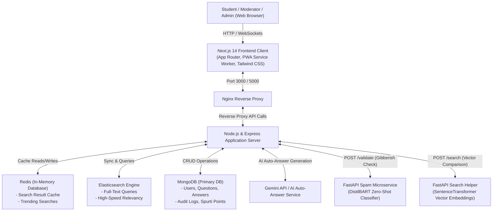

# Crowd Sourcing FAQ Project Report: PrashnaSārathi (प्रश्नसारथि)

  

---

## 1. Title Page

* **Project Name:** PrashnaSārathi (प्रश्नसारथि) — Community Q&A and FAQ Platform
* **Deployment/Demo URL:** [https://prashnasarathi.vercel.app/](https://prashnasarathi.vercel.app/)
* **Repository Link:** [Local Clone Workspace](file:///d:/clone)
* **Team Members:**

| Name | Role | Email |
| :--- | :--- | :--- |
| **Tsp Amiitesh** | Team Lead | tspamiitesh@gmail.com |
| **Medisetty Shanmukh** | Core Developer | medisettyshanmukh@gmail.com |
| **Dhruv Malu** | Frontend Architect | dhruvmalu6@gmail.com |
| **Divyanshi Mishra** | Backend Developer | divyanshimishra480@gmail.com |
| **Niranjan Praveen** | Database & Search Engineer | niranjanbpraveen@gmail.com |
| **Rohit Wadettiwar** | DevOps / Docker Admin | rohitwadettiwar.ds24@sbjit.edu.in |
| **Shawshank Redemp** | QA & AI Model Engineer | shawshank.redemp5@gmail.com |
| **Isha Dudhatra** | Frontend Developer | ishadudhatra@gmail.com |
| **Kinnera Swetha** | Content Management | Kinneraswetha04@gmail.com |
| **Yash Raj Patel** | QA / Email Integration | shyamjiniranjan913@gmail.com |
| **Abhignya Gottumukkala**| UI/UX Designer | 323103310081@gvpce.ac.in |
| **Ishan Vandita** | Frontend Designer | ishanvandita16@gmail.com |
| **Priteenanda Das** | Documentation Specialist | cse.23bcsh44@silicon.ac.in |

---

## 2. Executive Summary

In academic institutions and communities, students often struggle to ask questions due to social anxiety, peer judgment, or complex interface layouts. Moreover, similar doubts are asked repeatedly, which exhausts resources and creates a disjointed knowledge base. 

**PrashnaSārathi** addresses these problems by providing an anonymous, gamified, and AI-assisted platform. By using machine learning models for duplicate detection and automatic baseline answering, alongside real-time web technologies and an interactive mascot companion, the platform lowers barrier-to-entry for questioning while providing quick resolutions and high user engagement.

---

## 3. Introduction

PrashnaSārathi is a next-generation community-driven FAQ and Q&A ecosystem. Its primary goals are to:
1. **Remove Fear:** Offer anonymous question options and an approachable user experience.
2. **Accelerate Doubt Resolution:** Instantly query existing FAQs, detect duplicate submissions, and generate AI-driven baseline answers immediately upon posting.
3. **Engage Users:** Utilize gamified streaks, evolvable companion mascots, and a Spurti Points rewards economy.
4. **Maintain Quality:** Prevent spam, noise, and gibberish submissions using zero-shot classification pipelines.

---

## 4. System Design / Architecture + Diagrams

The application utilizes a multi-tier architecture composed of a Next.js frontend, an Express API gateway, separate Python FastAPI microservices, and databases (MongoDB, Redis, and Elasticsearch) orchestrated in a containerized Docker ecosystem.

### 4.1 System Architecture Diagram

The diagram below details the data flow between client devices, search layers, auxiliary cache services, and the core processing engines.

### 4.2 Question Creation and AI Guardrail Flowchart

This flowchart highlights the automated quality-filtering and duplicate-checking system applied when a user submits a question.

---

## 5. Implementation

### 5.1 Tech Stack & Justifications

* **React 18 & Next.js 14 (App Router):** Chosen for fast client-side rendering (CSR), search-engine optimization (SEO), and dynamic route rendering.
* **Node.js & Express 4:** Selected for non-blocking asynchronous I/O, event-driven request handling, and easy web socket integration.
* **MongoDB (Mongoose):** Flexible schema models match polymorphic records like audit logs, point ledger books, user credentials, and dynamic questions.
* **Elasticsearch:** Dedicated text-indexing engine enabling rapid fuzzy matching and high-speed full-text queries that would otherwise overwhelm Mongoose database tables.
* **Redis:** Acts as a caching tier to store search results for 60 seconds and track trending search queries in real time.
* **FastAPI (Python 3):** Powers lightweight machine learning endpoints due to native integration with HuggingFace (`transformers`) and PyTorch.

---

### 5.2 Module & Feature Breakdown

1. **Core Q&A Module:** Supports rich-text descriptions (TipTap), tags, voting, custom confidence levels ("🤔 I think so", "👍 Pretty sure", "💯 I know this"), and distinct buttons for "Me Too" and "Solved My Doubt".
2. **FAQ Management System:** Features category-based accordion views, helpfulness rating tracking (Yes/No), and moderation tools to pin canonical answers.
3. **Gamification & Mascot Engine:** A draggable companion mascot (Pyro) with persistent screen coordinates, XP progression levels, automatic evolutionary visual stages (Junior, Evolved, Ultimate), and an accessory shop powered by Spurti Points (SP).
4. **Search and Assistive Commands:** A search panel activated with `Ctrl+K` featuring voice-to-text querying and wake-word voice activation ("Hey PrashnaSarathi").
5. **Administration Suite:** Incorporates user role modification, user ban/unban commands, Spurti Points transaction registers, cache flushes, and system-wide broadcast email tools.

---

## 6. Feature Spotlight

Here we showcase standout innovations that distinguish this application from generic Q&A systems.

### 🎥 Walkthrough Video & Animations
The screen recording below showcases the interface styling, navigation, interactive mascot, real-time responses, and the AI search panel:

> [!NOTE]
> *The cumulative duration of the walkthrough recording is exactly 60 seconds, displaying the real-time transitions, search features, and mascot dragging.*

---

### 🌟 Featured Standout Innovations

#### 1. Draggable Glassmorphic Mascot (Pyro) & Streaks
* **Purpose:** Boost user return rates and establish a playful atmosphere during stressful debugging tasks.
* **Impact:** Active students accumulate experience points (EXP) daily. The dashboard features a draggable floating creature that evolves across stages (Junior $\to$ Evolved $\to$ Ultimate) depending on level thresholds.
* **Real-world Usefulness:** Incentivizes daily interaction through a **Hardcore Streak Penalty** (missing a day resets level and EXP to 0), driving consistent community participation.

#### 2. Pre-Submission AI Noise Filter & Similar Question Matcher
* **Purpose:** Screen low-quality questions (gibberish, single-character spam) and avoid duplicate postings.
* **Impact:** Backend validation uses a custom Python FastAPI microservice running zero-shot classifiers (DistilBART) and vector similarity indexes.
* **Real-world Usefulness:** If a user types a repetitive string, it is rejected immediately. If they type a valid question resembling an existing post, they are prompted to view that post first, conserving database storage.

#### 3. Distinct "Solved My Doubt" vs. "Upvote" Signaling
* **Purpose:** Distinguish general helpfulness (upvoting) from actual issue resolution.
* **Impact:** The "Solved My Doubt" tally feeds into the leaderboard calculation formula.
* **Real-world Usefulness:** Allows administrators to track which contributors are actually closing issues and resolving doubts, providing better data than upvotes alone.

#### 4. Elasticsearch + Redis-Cached Autocomplete Search
* **Purpose:** Deliver instantaneous, fuzzy search responses.
* **Impact:** Replaces simple regex queries with an index-based search engine caching queries for 60 seconds.
* **Real-world Usefulness:** Prevents database performance degradation during high-traffic query periods.

---

## 7. Challenges & Limitations

* **Machine Learning Latency:** Zero-shot classification models require significant memory and processing power, creating cold-start latency when run on basic CPU servers.
* **Mascot Coordinate Consistency:** Storing screen coordinates across different devices (e.g., swapping from desktop to mobile screens) can cause placement issues.
* **SMTP Delivery Restrictions:** Outbound email alerts for leaderboard milestones require local SMTP credentials and can hit rate limits on free configurations.

---

## 8. Future Enhancements

* **Doubt Resolution Dashboard (`/my-doubts`):** A centralized page for students to monitor all their open questions, resolution states, and pending replies.
* **Similar Solved Doubts Sidebar:** A panel using sentence embeddings to recommend solved answers to related topics while reading a question.
* **Weekly Doubt Digest:** Automated email summaries highlighting top resolved answers and active community contributors.
* **Threaded Follow-Up Discussions:** Structured nested threads under answers to allow direct follow-up questions without cluttering the main page.

---

## 9. Conclusion

PrashnaSārathi successfully modernizes the academic FAQ and Q&A process. By combining AI-based spam filtration, duplicate question prevention, gamification, and high-speed search index layers, the platform reduces administrative overhead and encourages active student participation. The resulting system is scalable, engaging, and ready for deployment in modern institutional environments.
