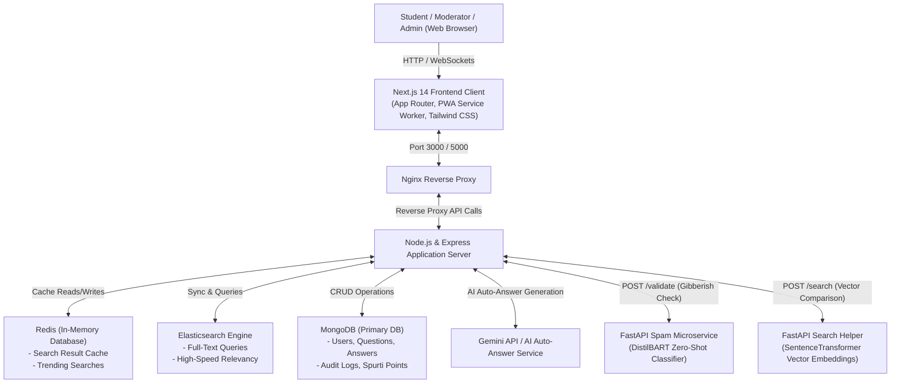

# Crowd Sourcing FAQ Project Report: PrashnaSārathi (प्रश्नसारथि)

  

---

## 1. Title Page

* **Project Name:** PrashnaSārathi (प्रश्नसारथि) — Community Q&A and FAQ Platform
* **Deployment/Demo URL:** [https://prashnasarathi.vercel.app/](https://prashnasarathi.vercel.app/)
---

## 2. Executive Summary

### 2.1 The Challenge
In educational institutions and community learning hubs, students frequently encounter obstacles when trying to resolve their doubts. Two primary problems exist:
1. **Fear of Asking:** Many students suffer from social anxiety or fear of peer judgment, preventing them from raising their hand in class or posting on public forums.
2. **Repetitive Workload:** Teachers and administrators are often overwhelmed by the same questions being asked repeatedly, leading to delayed responses and scattered information.

### 2.2 The Solution: PrashnaSārathi
**PrashnaSārathi** is an intelligent, community-driven Q&A and FAQ platform designed to make learning collaborative, engaging, and efficient. The platform organizes its functionalities into five key areas:
* **Core Q&A Module:** Supports anonymous posting to remove the fear of asking, similar question warnings to prevent duplicates, automated content quality checks, confidence indicators on replies, and an AI Auto-Answer service that generates baseline replies instantly.
* **FAQ System Module:** Organizes official institutional knowledge into category-based accordion views, monitors FAQ helpfulness via a feedback tracker, and tags verified answers with official badges.
* **Gamification Module:** Encourages student participation through daily streaks with hardcore penalty resets, a reputation/Spurti Points (SP) reward economy, and a dynamic leaderboard ranking top contributors.
* **Search & Discovery Module:** Features a fast Ctrl+K instant search modal, powered by a hybrid Elasticsearch/Mongoose engine, and Redis caching for trending search queries.
* **Admin & Moderation Module:** Equips moderators with dashboard statistics, role/user management with audit logs, and a cache manager to push updates instantly.

### 2.3 Key Outcomes & Impact
By deploying PrashnaSārathi, communities can achieve:
* **Deliberate Quality Control:** Zero-shot AI filtering blocks spam while similarity searches guide students to existing answers before they submit a duplicate.
* **Friendly Peer Competition:** Streaks and points incentivize users to write high-quality answers and climb the leaderboard rankings.
* **Rapid Doubt Resolution:** Real-time AI auto-answers and cached search queries ensure students get accurate guidance in seconds, saving valuable instructor time.

---

## 3. Introduction

### 3.1 Background & Context
In modern educational institutions and learning communities, doubt resolution is one of the most critical parts of academic success. However, traditional communication methods are often fragmented. Important academic information, course FAQs, and students' doubts end up scattered across emails, chat groups, and local message boards. This fragmentation leads to:
* **Information Loss:** Highly valuable answers provided by professors or senior peers are lost in chat histories, meaning the same questions must be answered repeatedly.
* **Student Hesitation:** Many students feel intimidated to ask questions in large groups or public forums due to the fear of peer judgment or social anxiety.
* **Instructor Burnout:** Faculty members and course moderators spend excessive hours answering duplicate questions instead of focusing on complex doubts.

**PrashnaSārathi** (Sanskrit for *"The Question Guide"* or *"Doubt Charioteer"*) was created to solve these challenges. It establishes a centralized, structured, and intelligent "single source of truth" for academic doubts and official institutional information.

---

### 3.2 The Core Pillars of PrashnaSārathi
To bridge the gap between students, educators, and knowledge, the platform is designed around four key operational pillars:

#### 1. Safe & Inclusive Q&A (Removing the Fear of Asking)
Social anxiety is a real barrier to learning. PrashnaSārathi offers an **Anonymous Posting** toggle for both questions and answers. Students can ask simple, foundational, or sensitive questions without revealing their identity to their peers. This creates a safe learning environment where the only priority is finding the solution.

#### 2. Instant Search & Automated Answering (Accelerating Resolution)
Students expect fast answers. The platform uses a hybrid architecture to ensure doubts are resolved in seconds:
* **Pre-Submission Similarity Check:** As a user types, the system instantly cross-references their text with existing questions to warn them of duplicates.
* **Instant Ctrl+K Search:** A global autocomplete panel allows users to search across FAQs, questions, and users instantly.
* **AI Auto-Answers:** For newly posted questions, the platform triggers a background AI service to generate a context-grounded baseline reply immediately, providing students with instant guidance.

#### 3. Healthy Engagement Mechanics (Gamifying Academic Help)
Traditional forums feel dry and transactional. PrashnaSārathi introduces game mechanics to encourage active peer-to-peer assistance:
* **The Mascot Companion (Pyro):** An evolvable creature representing the user's progress.
* **Streaks & Progression:** A daily login streak tracker keeps students returning. EXP is awarded for daily activity, but a **Hardcore Penalty** resets progress if a day is missed.
* **Reward Economy:** Users earn **Spurti Points (SP)** for writing helpful answers, which they can spend in the shop to purchase accessories for Pyro.
* **Leaderboards:** Ranks top community contributors, highlighting active peer helpers.

#### 4. Automated Quality Assurance (Protecting Community Value)
To prevent the platform from turning into a chaotic chatroom, PrashnaSārathi features automated quality controls:
* **FastAPI Spam Microservice:** An AI-powered classification pipeline checks new questions for spam, single-character keyboards smashes, and off-topic noise before they get published.
* **Moderation Suite:** Administrators and moderators can flag inappropriate content, modify user roles, ban toxic accounts, and clear cache storage to keep information clean and safe.

---

## 4. System Design / Architecture + Diagrams

The application utilizes a multi-tier architecture composed of a Next.js frontend, an Express API gateway, separate Python FastAPI microservices, and databases (MongoDB, Redis, and Elasticsearch) orchestrated in a containerized Docker ecosystem.

### 4.1 System Architecture Diagram

The diagram below details the data flow between client devices, search layers, auxiliary cache services, and the core processing engines.

### 4.2 Question Creation and AI Guardrail Flowchart

This flowchart highlights the automated quality-filtering and duplicate-checking system applied when a user submits a question.

---

## 5. Implementation

### 5.1 Tech Stack & Justifications

* **React 18 & Next.js 14 (App Router):** Chosen for fast client-side rendering (CSR), search-engine optimization (SEO), and dynamic route rendering.
* **Node.js & Express 4:** Selected for non-blocking asynchronous I/O, event-driven request handling, and easy web socket integration.
* **MongoDB (Mongoose):** Flexible schema models match polymorphic records like audit logs, point ledger books, user credentials, and dynamic questions.
* **Elasticsearch:** Dedicated text-indexing engine enabling rapid fuzzy matching and high-speed full-text queries that would otherwise overwhelm Mongoose database tables.
* **Redis:** Acts as a caching tier to store search results for 60 seconds and track trending search queries in real time.
* **FastAPI (Python 3):** Powers lightweight machine learning endpoints due to native integration with HuggingFace (`transformers`) and PyTorch.

---

### 5.2 Module & Feature Breakdown

1. **Core Q&A Module:** Supports rich-text descriptions (TipTap), tags, voting, custom confidence levels ("🤔 I think so", "👍 Pretty sure", "💯 I know this"), and distinct buttons for "Me Too" and "Solved My Doubt".
2. **FAQ Management System:** Features category-based accordion views, helpfulness rating tracking (Yes/No), and moderation tools to pin canonical answers.
3. **Gamification & Mascot Engine:** A draggable companion mascot (Pyro) with persistent screen coordinates, XP progression levels, automatic evolutionary visual stages (Junior, Evolved, Ultimate), and an accessory shop powered by Spurti Points (SP).
4. **Search and Assistive Commands:** A search panel activated with `Ctrl+K` featuring voice-to-text querying and wake-word voice activation ("Hey PrashnaSarathi").
5. **Administration Suite:** Incorporates user role modification, user ban/unban commands, Spurti Points transaction registers, cache flushes, and system-wide broadcast email tools.

---

## 6. Feature Spotlight

Here we showcase a detailed breakdown of all major features and standout functionalities of PrashnaSārathi. 

### 🎥 Walkthrough Video & Animations
The screen recording below showcases the interface styling, navigation, interactive mascot, real-time responses, and the AI search panel:

> [!NOTE]
> *The cumulative duration of the walkthrough recording is exactly 60 seconds, displaying the real-time transitions, search features, and mascot dragging.*

---

### 🌟 Detailed Feature Breakdown

#### 6.1 Core Q&A Module

* **Anonymous Posting:** Option to post questions anonymously.
  * *Purpose:* Protect student privacy and encourage questioning.
  * *Real-world Usefulness:* Helps shy students ask simple or sensitive doubts without fear of judgment from peers.
* **Similar Question Warning:** Shows similar existing questions in real-time as the user types.
  * *Purpose:* Prevent duplicate questions.
  * *Real-world Usefulness:* Reduces website clutter and guides students straight to existing solutions.
* **Content Quality Checker:** An AI service that scans new questions to filter out gibberish or spam.
  * *Purpose:* Keep the community platform clean.
  * *Real-world Usefulness:* Instantly rejects random strings (like "aaaaa" or keyboard-smash text) before they get posted.
* **Confidence Indicators on Answers:** When submitting an answer, users pick their level of confidence: `🤔 I think so`, `👍 Pretty sure`, or `💯 I know this`.
  * *Purpose:* Inform readers of answer certainty.
  * *Real-world Usefulness:* Helps students evaluate the reliability of peer answers.
* **"Me Too" and "Solved My Doubt" Indicators:**
  * *Purpose:* Track user interest and genuine problem resolution.
  * *Real-world Usefulness:* "Me Too" boosts the priority of unanswered doubts. "Solved My Doubt" tracks how many students were actually helped, providing a better success metric than generic upvotes.
* **AI Auto-Answer Service:** Backend service that automatically generates context-grounded baseline replies for student questions.
  * *Purpose:* Decrease reply wait times.
  * *Real-world Usefulness:* Students get a helpful AI-driven response within seconds, resolving common doubts instantly.

#### 6.2 FAQ System Module

* **Category Browsing:** FAQs are organized by subject categories in clean accordion views.
  * *Purpose:* Make official institutional information easily browsable.
  * *Real-world Usefulness:* Quick navigation for standard issues like NOC applications, exam rules, or fee guidelines.
* **FAQ Feedback Tracker:** A simple "Yes / No" helpfulness feedback buttons on each FAQ page.
  * *Purpose:* Monitor the quality of official FAQs.
  * *Real-world Usefulness:* Flags outdated or confusing FAQs so administrators know what to update.
* **Official Badges:** Verified answers and FAQ pages stand out with unique tags.
  * *Purpose:* Establish trust markers for verified content.
  * *Real-world Usefulness:* Students instantly recognize answers published by professors or administrators.

#### 6.3 Gamification Module

* **Daily Login Streaks & Progression:** A streak tracker that awards +15 EXP points for daily logins. Pyro evolves into different stages (Junior $\to$ Evolved $\to$ Ultimate) depending on user level thresholds.
  * *Purpose:* Retain daily active users.
  * *Real-world Usefulness:* Hardcore Reset Penalty resets user level and EXP to 0 if they miss a single day, introducing game mechanics to keep students logging in.
* **Spurti Points (SP):** A reward economy where students earn points for answering doubts and spend them on accessories for Pyro (e.g., Shark Hat, Balloons).
  * *Purpose:* Incentivize community contribution.
  * *Real-world Usefulness:* Encourages students to write high-quality answers to earn virtual rewards.
* **Dynamic Contribution Leaderboard:** A live board ranking top users in the community.
  * *Purpose:* Foster friendly competition and highlight top helpers.
  * *Real-world Usefulness:* Ranks students based on their accumulated reputation and Spurti Points, allowing administrators to reward the most helpful peers.

#### 6.4 Search and Discovery Module

* **Instant Search Modal (Ctrl+K):** A global search overlay accessible from anywhere on the platform by pressing Ctrl+K or /.
  * *Purpose:* Provide fast access to knowledge.
  * *Real-world Usefulness:* Search across questions, FAQs, and users instantly without reloading pages.
* **Hybrid Search Engine:** Powered by Elasticsearch with a fallback to database queries.
  * *Purpose:* Perform fast, fuzzy search matching.
  * *Real-world Usefulness:* Handles typos and retrieves relevant results immediately.
* **Redis Caching:** Caches search results and tracks trending keywords.
  * *Purpose:* Speed up common searches and reduce database load.
  * *Real-world Usefulness:* Instant loading of popular queries during peak exam preparation times.

#### 6.5 Admin & Moderation Module

* **Admin Dashboard Stats:** Live charts showing daily active users (DAU), question volumes, and pending moderation queues.
  * *Purpose:* Keep track of community health.
  * *Real-world Usefulness:* Provides administrative overview at a glance.
* **User Management & Audit Logs:** Tools to edit user roles, search users, and ban/unban with reason tracking.
  * *Purpose:* Maintain a safe platform.
  * *Real-world Usefulness:* Allows moderators to take action on toxic users and log all moderation steps for accountability.
* **One-Click Cache Manager:** Button for administrators to clear Redis caches instantly.
  * *Purpose:* Refresh static information.
  * *Real-world Usefulness:* Forces immediate updates when official FAQ changes occur.

---

## 7. Challenges & Limitations

* **Machine Learning Latency:** Zero-shot classification models require significant memory and processing power, creating cold-start latency when run on basic CPU servers.
* **Mascot Coordinate Consistency:** Storing screen coordinates across different devices (e.g., swapping from desktop to mobile screens) can cause placement issues.
* **SMTP Delivery Restrictions:** Outbound email alerts for leaderboard milestones require local SMTP credentials and can hit rate limits on free configurations.

---

## 8. Future Enhancements

* **Doubt Resolution Dashboard (`/my-doubts`):** A centralized page for students to monitor all their open questions, resolution states, and pending replies.
* **Similar Solved Doubts Sidebar:** A panel using sentence embeddings to recommend solved answers to related topics while reading a question.
* **Weekly Doubt Digest:** Automated email summaries highlighting top resolved answers and active community contributors.
* **Threaded Follow-Up Discussions:** Structured nested threads under answers to allow direct follow-up questions without cluttering the main page.

---

## 9. Conclusion

PrashnaSārathi successfully modernizes the academic FAQ and Q&A process. By combining AI-based spam filtration, duplicate question prevention, gamification, and high-speed search index layers, the platform reduces administrative overhead and encourages active student participation. The resulting system is scalable, engaging, and ready for deployment in modern institutional environments.
