# PrashnaSārathi (प्रश्नसारथि) — Community Q&A and FAQ Platform

<div align="center">
  
</div>

<br>

A community-driven Q&A and FAQ platform designed to help students ask doubts without fear, get answers fast, and feel their problems are genuinely solved.

**Live Demo:** [https://prashnasarathi.vercel.app/](https://prashnasarathi.vercel.app/)

---

## Team Members

| Name | Email |
|------|-------|
| Tsp Amiitesh (Team Lead) | tspamiitesh@gmail.com |
| Medisetty Shanmukh | medisettyshanmukh@gmail.com |
| Dhruv Malu | dhruvmalu6@gmail.com |
| Divyanshi Mishra | divyanshimishra480@gmail.com |
| Niranjan Praveen | niranjanbpraveen@gmail.com |
| Rohit Wadettiwar | rohitwadettiwar.ds24@sbjit.edu.in |
| Shawshank Redemp | shawshank.redemp5@gmail.com |
| Isha Dudhatra | ishadudhatra@gmail.com |
| Kinnera Swetha | Kinneraswetha04@gmail.com |
| Yash Raj Patel | shyamjiniranjan913@gmail.com |
| Abhignya Gottumukkala | 323103310081@gvpce.ac.in |
| Ishan Vandita | ishanvandita16@gmail.com |
| Priteenanda Das | cse.23bcsh44@silicon.ac.in |

---

## Tech Stack

| Layer     | Technology                                      |
| --------- | ----------------------------------------------- |
| Frontend  | Next.js 14 (App Router), React 18, Tailwind CSS |
| Backend   | Node.js, Express 4, MongoDB (Mongoose), Redis   |
| Search    | Elasticsearch                                   |
| Realtime  | Socket.IO                                       |
| Events    | Kafka (optional)                                |
| Infra     | Podman / Docker, Nginx                          |

---

## Project Structure

```
prashnasarathi/
├── backend/              # Express API server (port 5000)
│   ├── assets/           # Static asset templates and resources
│   ├── config/           # DB, Redis, ES, Firebase, Kafka connections
│   ├── controllers/      # Route handlers (auth, questions, answers, search, etc.)
│   ├── data/             # Local database JSON exports
│   ├── middleware/       # JWT auth, error handling, rate limiting, uploads
│   ├── models/           # Mongoose schemas (User, Question, Answer, FAQ, etc.)
│   ├── routes/           # Express route definitions (12 route files)
│   ├── seeds/            # Database seed scripts
│   ├── services/         # ES search, recommendations, analytics, push notifications, auto-answer
│   ├── socket/           # Socket.IO real-time event setups
│   ├── uploads/          # Local storage path for uploaded user files
│   └── utils/            # Helpers, validators, permissions, email templates
├── frontend/             # Next.js 14 App Router (port 3000)
│   ├── app/              # App Router pages (faqs, questions, admin, auth, saved, etc.)
│   ├── components/       # Shared React components (AI widget, Search input, cards, etc.)
│   ├── context/          # Auth, Socket, Theme, and Notification Contexts
│   ├── data/             # Frontend local static JSON metadata
│   ├── hooks/            # Custom hooks (keyboard shortcuts, PWA installers)
│   ├── lib/              # API clients & utilities
│   ├── public/           # Static files (manifest, sw.js, icons, etc.)
│   ├── pwa/              # PWA service worker configurations
│   ├── scripts/          # Build scripts (sw.js compiler, versions)
│   ├── services/         # Frontend operations and API services
│   ├── styles/           # Global styles and Tailwind configuration
│   └── tailwind.config.js# Custom Tailwind design utility mappings
├── FastAPI_python_model/ # FastAPI AI microservice (spam & noise classification)
│   ├── main.py           # FastAPI server entry point
│   ├── Dockerfile        # Container setup for Python dependencies
│   └── requirements.txt  # Python packages list
├── faq-service/          # Python FAQ classification microservice helper
│   ├── main.py           # Python script entry point
│   └── requirements.txt  # Python dependencies list
├── nginx/                # Nginx reverse proxy configurations
├── podman/               # Podman/Docker deployment configuration files
├── kafka/                # Optional Kafka docker-compose configurations
├── docker-compose.yml    # Multi-service container orchestration mapping
├── .dockerignore         # Docker build context exclusions
├── setup-docker.sh       # Cross-platform Docker setup script
├── faqs-complete.json    # 126 FAQ items (seed data)
├── metadata.json         # Category metadata
├── vercel.json           # Frontend Vercel hosting configuration
└── todo.md               # Tracking document for fixes and features
```

---

## Key Features

### Home Dashboard

<div align="center">
  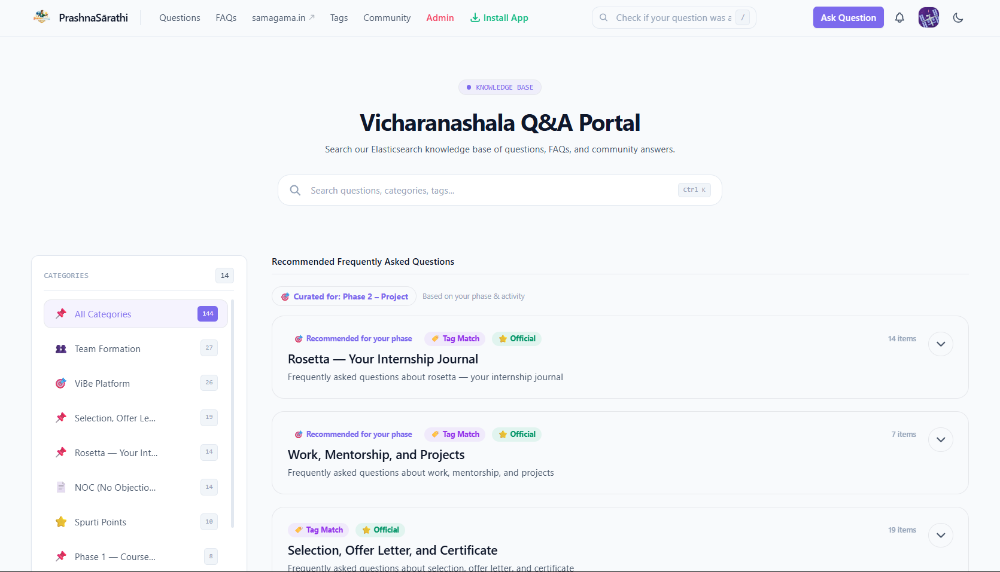
</div>

The main dashboard serves as the central hub with:
- Global search bar for instant knowledge discovery
- Personalized FAQ recommendations
- Category-based content filtering
- Quick access to all platform features

### Q&A Core

#### Ask Questions
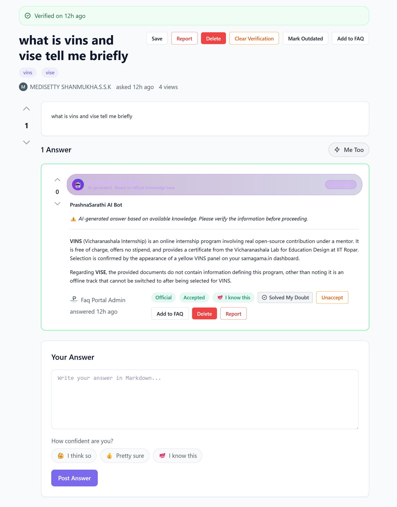
- Create questions with title, rich text body, and tags
- Anonymous posting option for sensitive doubts
- Duplicate detection before posting

#### Similar Questions Detection
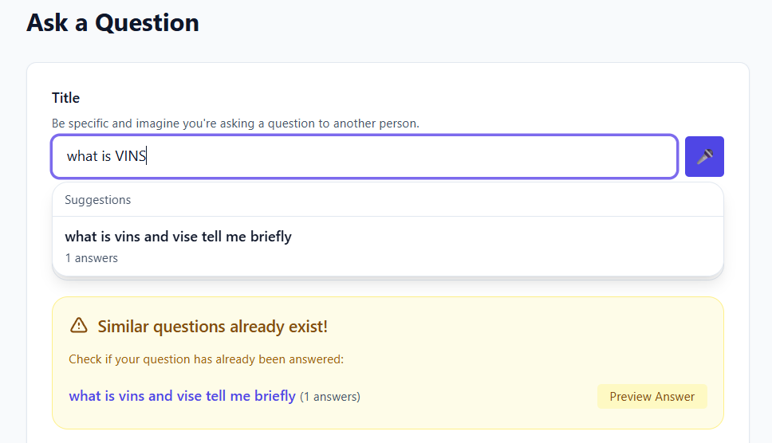
- Prevents duplicate questions before posting
- Shows similar existing questions
- Reduces clutter and encourages consolidation

#### Content Quality Filtering
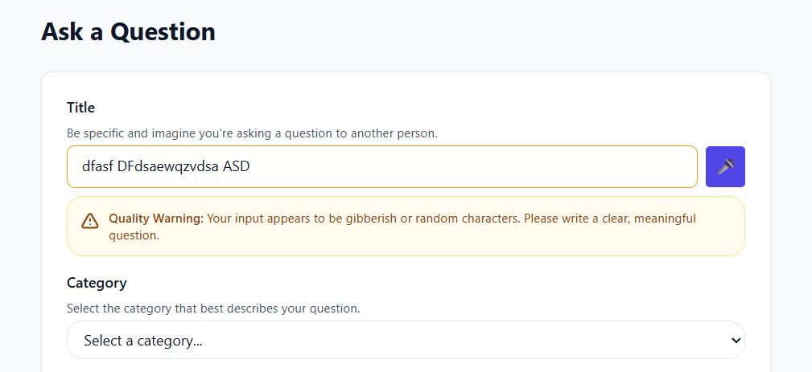
- AI-powered spam and noise classification
- Automatically filters low-quality content
- Maintains high-quality discussions

#### Answer with Confidence
Students can indicate their confidence level when answering:
- 🤔 "I think so" - Partial confidence
- 👍 "Pretty sure" - Moderate confidence  
- 💯 "I know this" - High confidence

#### Voting & Feedback System
- Upvote/downvote with optional reason feedback
- Helps surface quality content
- Provides constructive feedback to answer authors

#### Accept Answer
- Question authors or moderators can mark the best answer
- Visual celebration with confetti effect
- Helps future students find solutions quickly

#### "Me Too" Button
- Students signal they have the same doubt
- Bumps question priority in the algorithm
- Encourages community participation

#### "Solved My Doubt" Button
- Distinct from upvote - tracks genuine problem resolution
- Provides better metrics for answer quality
- Helps identify truly helpful responses

---

### FAQ System

#### FAQs Page
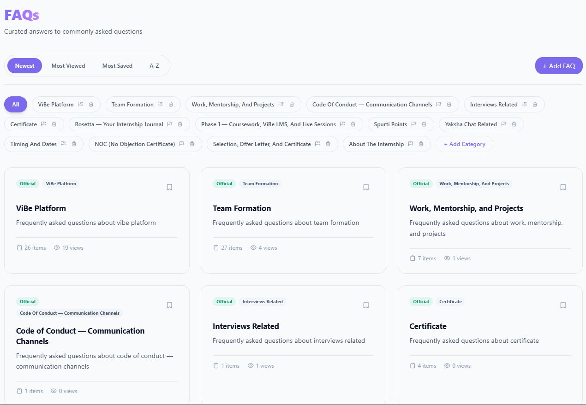
- Organized by subject categories
- Easy browsing and discovery
- Version tracking for updates

#### Detailed FAQ View
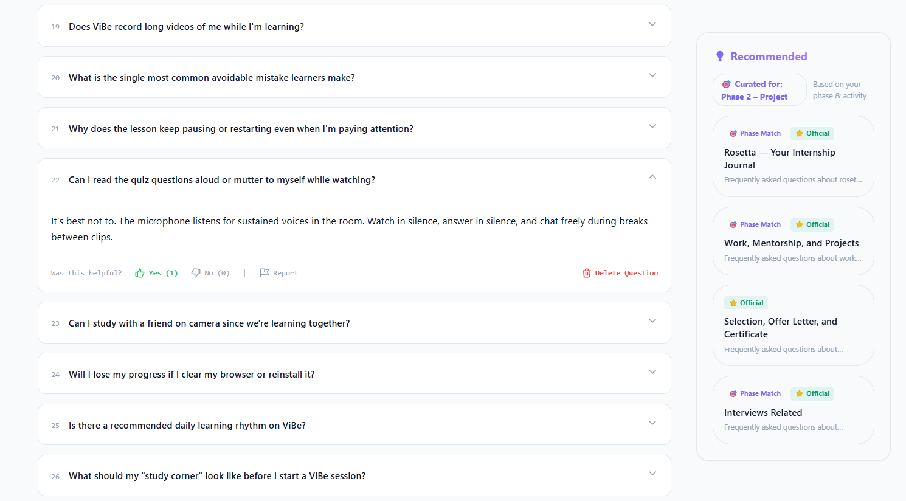
- Comprehensive FAQ answers with rich formatting
- Related questions and resources
- Helpfulness feedback tracking

#### Helpfulness Feedback
- Item-level Yes/No feedback tracking
- Helps identify outdated or unclear content
- Drives content improvement

#### Official Badges & Verification
- Verified official answers stand out
- Master FAQ program for canonical answers
- Trust markers for quality content

---

### Search & Discovery

#### Search Modal

- Full-text search across questions, FAQs, and users
- Press `Ctrl+K` or `/` to open from anywhere
- Elasticsearch-powered for speed and relevance

#### Search Results Page
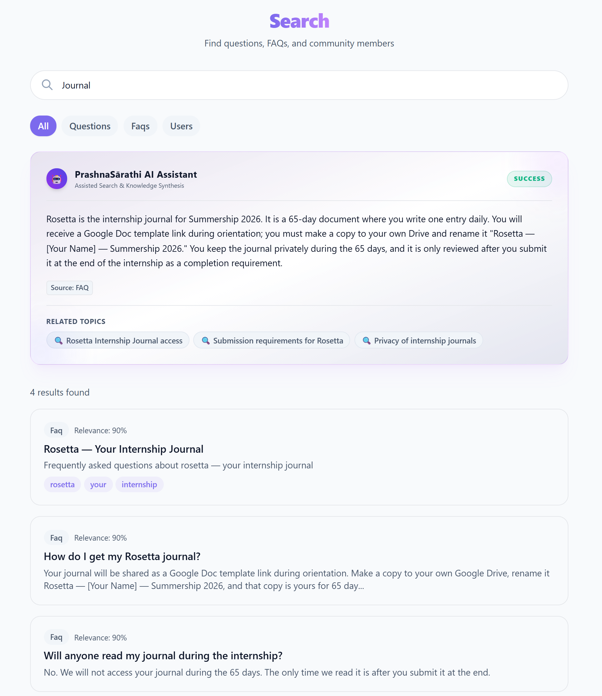
- Comprehensive search results with filters
- Sort by relevance, date, or popularity
- Highlighted matching terms

#### Keyboard Shortcuts

| Shortcut | Action |
|----------|--------|
| `Ctrl+K` or `/` | Open search modal |
| `j` or `↓` | Navigate down in lists |
| `k` or `↑` | Navigate up in lists |
| `Enter` | View/open selected item |
| `Esc` | Close modal or clear selection |

#### Tag Browsing

- Browse questions by topic tags
- Filter and sort options
- Related questions sidebar

#### Trending & Suggestions
- Trending searches powered by Redis caching
- Search suggestions with top 10 popular queries
- Real-time autocomplete

---

### User System

#### Authentication
- JWT-based secure authentication
- Registration with email verification
- Session management

#### User Profiles
- Custom avatars and bio
- Reputation system
- Achievement badges
- Activity statistics (questions, answers, votes)

#### Saved Content
- Save questions and FAQs for later
- Add personal notes
- Organize with custom tags
- Easy reference and review

#### Real-time Notifications
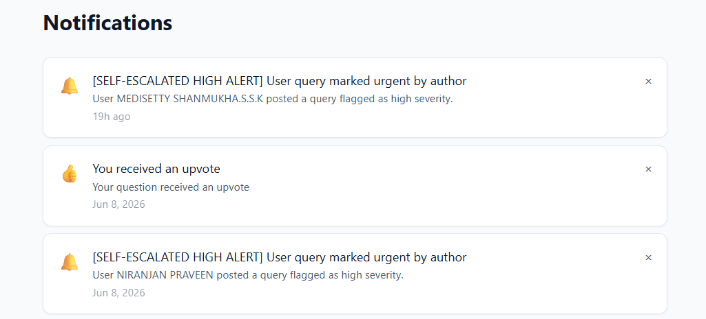
- New answers to your questions
- Answers accepted notifications
- Upvotes and "Me Too" alerts
- Live updates via Socket.IO

#### Dark Mode
- Automatic system preference detection
- Manual override with toggle
- Persists to localStorage
- Full dark theme support across all pages

#### Student Onboarding
- 4-step guided tour for new users
- Platform feature introduction
- Encourages engagement from day one

#### Role System
- **User** - Standard access
- **Moderator** - Content moderation privileges
- **Admin** - Full platform control

---

### Admin & Moderation

#### Admin Dashboard
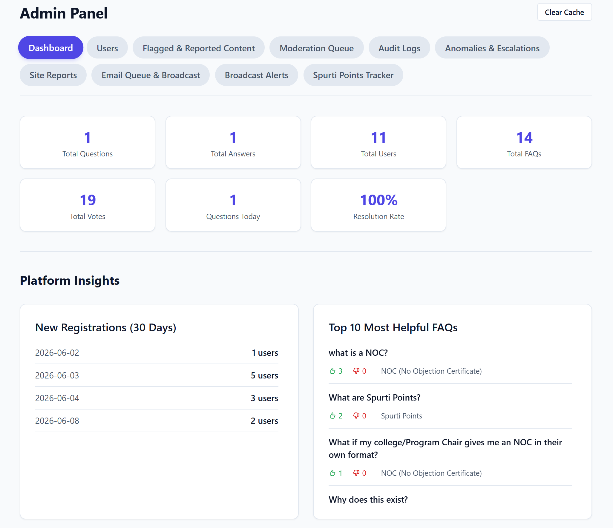
- Real-time platform statistics
- User activity metrics (DAU, questions, answers)
- Quick access to moderation tools

#### User Management
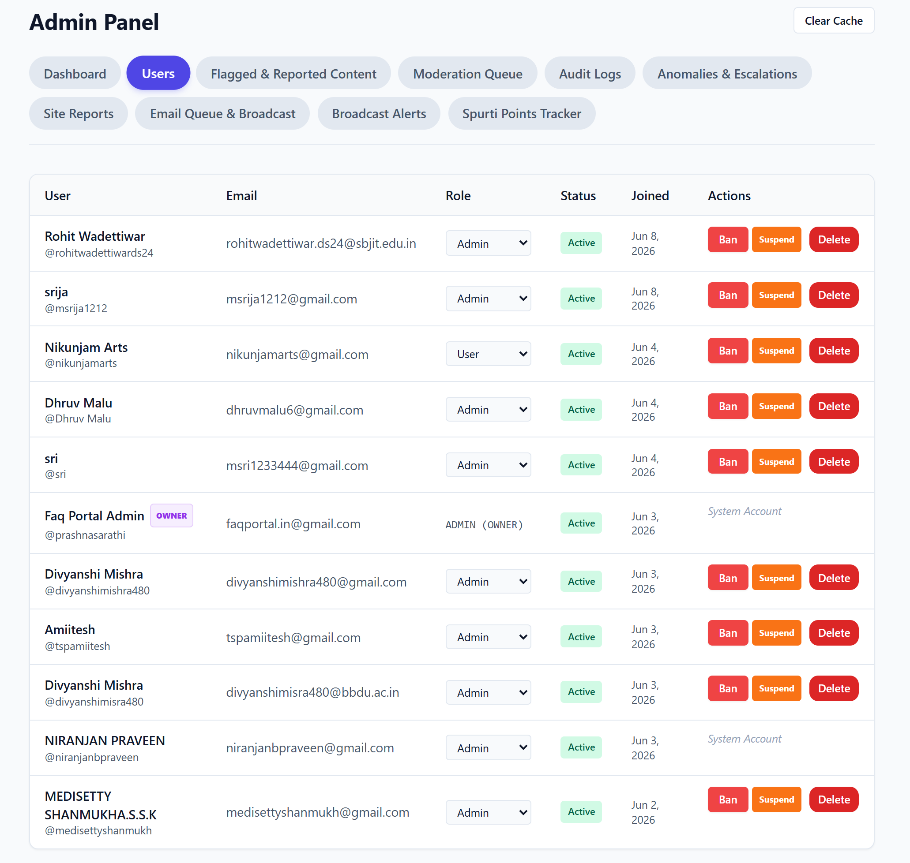
- View all registered users
- Change user roles (User/Moderator/Admin)
- Ban/unban users with reason tracking
- Search and filter functionality

#### Audit Logs
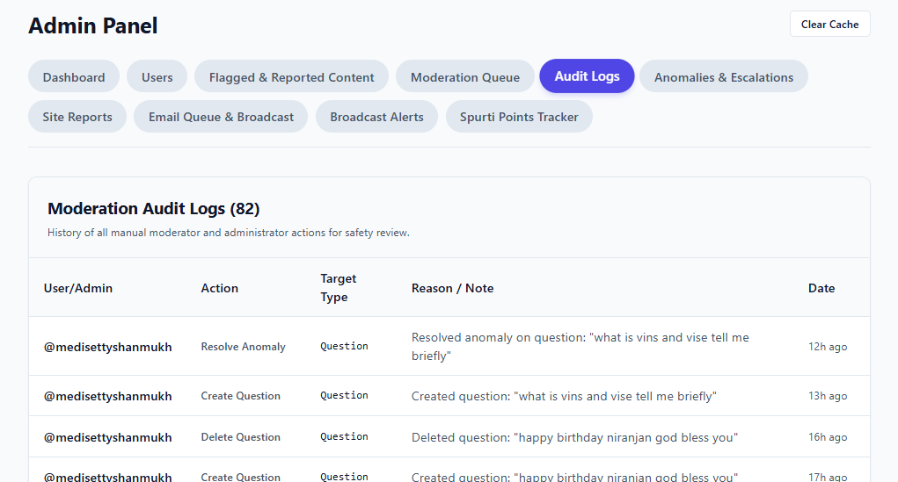
- Track all admin actions
- Moderation history
- Security and compliance monitoring

#### Spurti Points Tracker
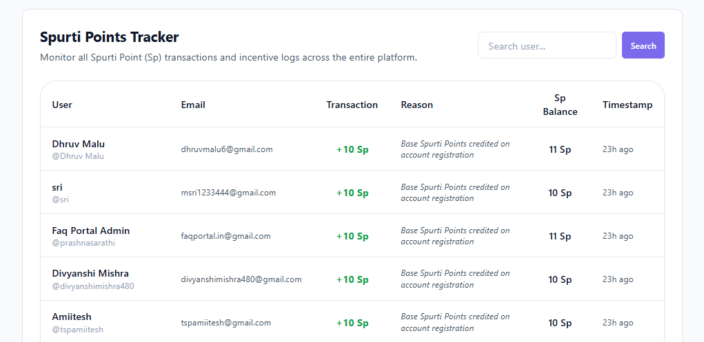
- Gamification points system
- Track user engagement and contributions
- Reward active community members

#### Flagged Content Queue
- Review reported questions and answers
- Approve or remove content
- Track moderation history

#### FAQ Management
- Verify FAQ accuracy
- Mark outdated content
- Promote questions to Master FAQ status

#### Cache Management
- One-click Redis cache clearing
- Improves performance after updates
- Admin-only access

---

### Community Features

#### Leaderboard
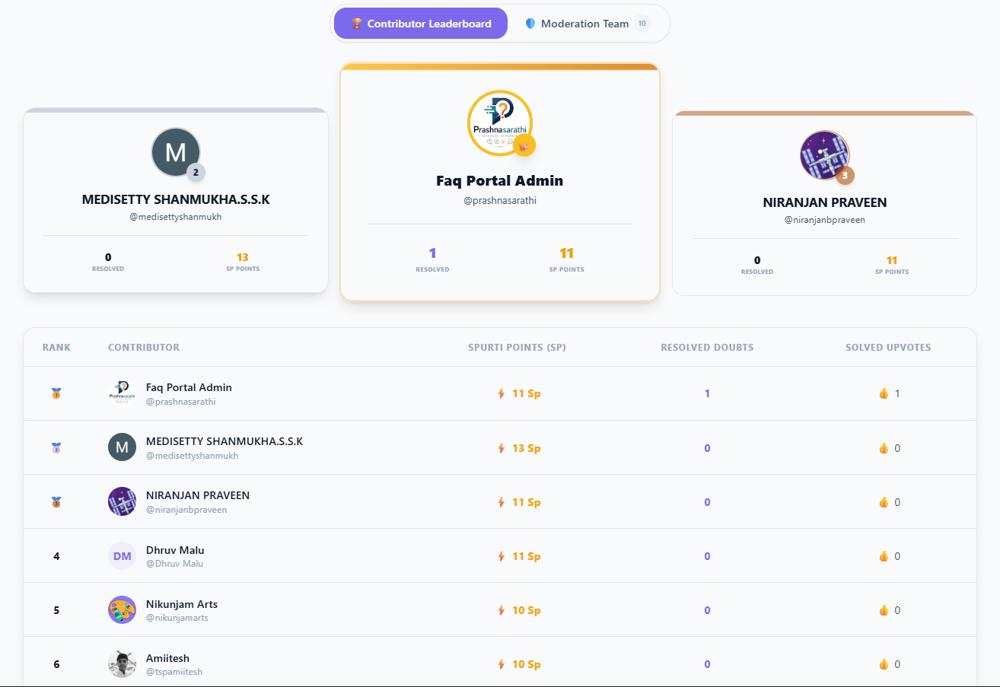
- Top contributors by reputation
- Weekly and all-time rankings
- Encourages healthy competition

#### Moderators
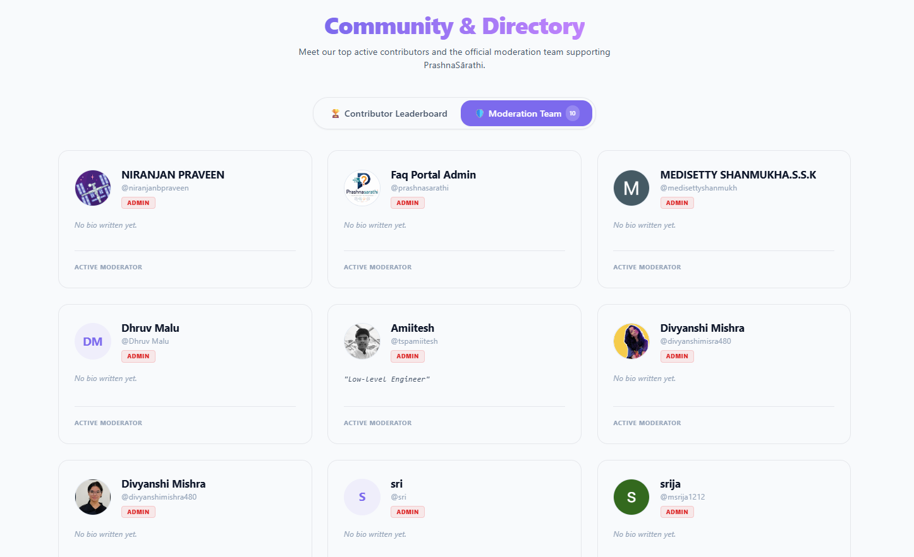
- List of community moderators
- Contact and reporting options
- Transparency in moderation

---

### UI/UX Highlights

#### Rich Text Editor
- TipTap-based WYSIWYG editor
- Formatting toolbar
- Image upload support

#### Markdown Rendering
- GitHub Flavored Markdown (GFM)
- Syntax highlighting for code blocks
- Consistent content presentation

#### Confetti Celebration
- Celebratory animation when answers are accepted
- Positive reinforcement for contributors
- Delightful user experience

#### View Counter
- Track question popularity
- Sort by most viewed
- Engagement metrics

#### SEO Optimized
- Structured data with JSON-LD
- Meta tags for social sharing
- Sitemap generation

---

### Real-time Features

#### Live Notifications
- Toast notifications for new activity
- No page refresh required
- Powered by Socket.IO

#### Real-time Updates
- Me-too counts update instantly
- Answer counts refresh in real-time
- Solved metrics update without page reload

---

## Running on Other Systems

To set up and run this project on a new developer environment or a separate host system, follow these steps:

### 1. Prerequisites
Ensure you have the following installed on the target system:
* **Docker / Podman & Docker Desktop** (with WSL2 enabled if on Windows)
* **Node.js 20.x** (for local host development without containers)

---

### 2. Environment Configuration (Crucial Step)
Since the `secrets.env` file containing sensitive private keys and credentials is ignored by version control, **you must create it manually** on the target system:

1. Copy `.env.example` to `secrets.env` in the root directory:
   ```bash
   cp .env.example secrets.env
   ```
2. Open `secrets.env` and populate the following values:
   * **Gmail SMTP Credentials**:
     ```env
     GMAIL_USER=your-email@gmail.com
     GMAIL_APP_PASSWORD=sixteencharacterpassword
     ```
     *(Note: The Gmail App Password must be 16 characters with no spaces. Requires 2FA enabled on your Google account).*
   * **Firebase Admin Credentials**:
     Provide the JSON string of your Firebase service account in `FIREBASE_SERVICE_ACCOUNT` on a single line.

---

### 3. Option A: Run via Docker Compose (Recommended)
This starts all required auxiliary services (MongoDB, Redis, Elasticsearch, FastAPI Spam Service, Node Backend, Next.js Frontend) in unified containers:

1. Run the cross-platform setup script or docker-compose command directly:
   ```bash
   # Option 1: Cross-platform script
   ./setup-docker.sh
   
   # Option 2: Direct docker-compose
   docker-compose up --build -d
   ```
2. Access the site at: http://localhost:3000

---

### 4. Option B: Running via Docker Directly (Without Compose)
If you want to run the application using standalone Docker commands without orchestrating through docker-compose:

1. **Start required database & cache containers**:
   ```bash
   # Start MongoDB
   docker run -d --name mongodb -p 27017:27017 mongo:6.0
   
   # Start Redis
   docker run -d --name redis -p 6379:6379 redis:7.0-alpine
   
   # Start Elasticsearch
   docker run -d --name elasticsearch -p 9200:9200 -e "discovery.type=single-node" -e "xpack.security.enabled=false" elasticsearch:8.11.1
   ```

2. **Build and run the Backend**:
   ```bash
   # Build the backend image
   docker build -t prashnasarathi-backend ./backend
   
   # Run the backend container using your secrets.env file
   docker run -d --name backend -p 5000:5000 --env-file secrets.env prashnasarathi-backend
   ```

3. **Build and run the Frontend**:
   ```bash
   # Build the frontend image
   docker build -t prashnasarathi-frontend ./frontend
   
   # Run the frontend container
   docker run -d --name frontend -p 3000:3000 prashnasarathi-frontend
   ```

---

### 5. Option C: Local Host Setup (No Containers)
If you prefer running services directly on the host machine:

1. Start local instances of **MongoDB** (`port 27017`), **Redis** (`port 6379`), and **Elasticsearch** (`port 9200`).
2. Install packages:
   ```bash
   cd backend && npm install
   cd ../frontend && npm install
   ```
3. Seed the FAQ Database:
   ```bash
   cd backend && npm run seed
   ```
4. Start development servers:
   * **Backend**: `cd backend && npm run dev` (starts on port 5000)
   * **Frontend**: `cd frontend && npm run dev` (starts on port 3000)